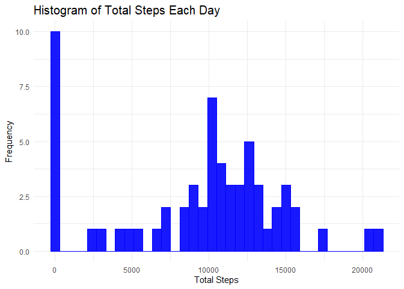
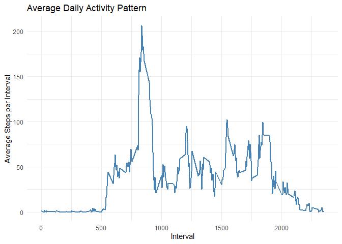
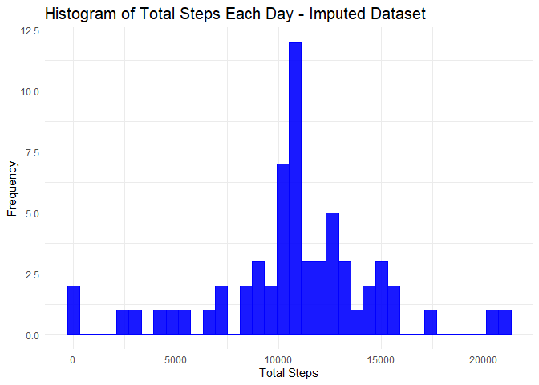
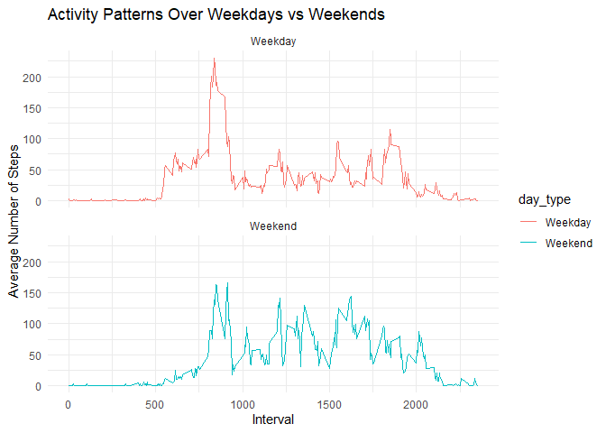

## Set up working directory

``` r
setwd("~/R training/Repro Res/RepData_PeerAssessment1")
dir() # check the files in working dir
```

```
## [1] "activity"                      "doc"                          
## [3] "instructions_fig"              "PA1_template.html"            
## [5] "PA1_template.md"               "PA1_template.Rmd"             
## [7] "PA1_template_files"            "README.md"                    
## [9] "RepData_PeerAssessment1.Rproj"
```
## load standard libraries

``` r
## load libraries----

library(dplyr)
```

```
## 
## Attaching package: 'dplyr'
```

```
## The following objects are masked from 'package:stats':
## 
##     filter, lag
```

```
## The following objects are masked from 'package:base':
## 
##     intersect, setdiff, setequal, union
```

``` r
library(data.table)
```

```
## 
## Attaching package: 'data.table'
```

```
## The following objects are masked from 'package:dplyr':
## 
##     between, first, last
```

``` r
library(ggplot2)
library(lubridate)
```

```
## 
## Attaching package: 'lubridate'
```

```
## The following objects are masked from 'package:data.table':
## 
##     hour, isoweek, mday, minute, month, quarter, second, wday, week,
##     yday, year
```

```
## The following objects are masked from 'package:base':
## 
##     date, intersect, setdiff, union
```

``` r
library(tidyr)
```

## Loading and preprocessing the data


``` r
activity <- read.csv("./activity/activity.csv")
str(activity)
```

```
## 'data.frame':	17568 obs. of  3 variables:
##  $ steps   : int  NA NA NA NA NA NA NA NA NA NA ...
##  $ date    : chr  "2012-10-01" "2012-10-01" "2012-10-01" "2012-10-01" ...
##  $ interval: int  0 5 10 15 20 25 30 35 40 45 ...
```

``` r
head(activity)
```

```
##   steps       date interval
## 1    NA 2012-10-01        0
## 2    NA 2012-10-01        5
## 3    NA 2012-10-01       10
## 4    NA 2012-10-01       15
## 5    NA 2012-10-01       20
## 6    NA 2012-10-01       25
```
### Calculate total steps for each day


``` r
histo <- activity %>%
                group_by(date) %>%
                        summarize(total_o = sum(steps, na.rm = TRUE)) 
# total_o represents total steps from original datasets
histo
```

```
## # A tibble: 61 × 2
##    date       total_o
##    <chr>        <int>
##  1 2012-10-01       0
##  2 2012-10-02     126
##  3 2012-10-03   11352
##  4 2012-10-04   12116
##  5 2012-10-05   13294
##  6 2012-10-06   15420
##  7 2012-10-07   11015
##  8 2012-10-08       0
##  9 2012-10-09   12811
## 10 2012-10-10    9900
## # ℹ 51 more rows
```

## What is mean total number of steps taken per day?
### Plot Histogram for the total steps taken each day

``` r
histo %>% ggplot(aes(x=total_o)) +
geom_histogram(binwidth=600, fill="blue", color="blue", alpha=0.9) +
        ggtitle("Bin size = 3") +
        labs(title = "Histogram of Total Steps Each Day", x = "Total Steps", y = "Frequency") +
        theme_minimal() +
        theme(plot.title = (element_text(size=15)
        ))
```

<!-- -->

``` r
histo
```

```
## # A tibble: 61 × 2
##    date       total_o
##    <chr>        <int>
##  1 2012-10-01       0
##  2 2012-10-02     126
##  3 2012-10-03   11352
##  4 2012-10-04   12116
##  5 2012-10-05   13294
##  6 2012-10-06   15420
##  7 2012-10-07   11015
##  8 2012-10-08       0
##  9 2012-10-09   12811
## 10 2012-10-10    9900
## # ℹ 51 more rows
```
### Calculate and report the mean and median of the total number of steps taken per day


``` r
mean_median_original <- histo %>%
        summarize(
                mean_steps_pd = mean(total_o, na.rm = TRUE),
                median_steps_pd = median(total_o, na.rm = TRUE)
                )
mean_median_original
```

```
## # A tibble: 1 × 2
##   mean_steps_pd median_steps_pd
##           <dbl>           <int>
## 1         9354.           10395
```

## What is the average daily activity pattern?
### Calculate the average steps in each 5 min time interval over Oct and Nov 2012

``` r
avg_steps <- activity %>%
                group_by(interval) %>%
                summarize(mean = mean(steps, na.rm = TRUE))
avg_steps
```

```
## # A tibble: 288 × 2
##    interval   mean
##       <int>  <dbl>
##  1        0 1.72  
##  2        5 0.340 
##  3       10 0.132 
##  4       15 0.151 
##  5       20 0.0755
##  6       25 2.09  
##  7       30 0.528 
##  8       35 0.868 
##  9       40 0     
## 10       45 1.47  
## # ℹ 278 more rows
```
### Create a time series plot (decided to used ggplot) avg_steps (y-axis and interval (x-axis)

``` r
p <- ggplot(avg_steps, aes(x = interval, y = mean)) +
  geom_line(color = "steelblue", linewidth = 1) +   # Line (type = 1)
  labs(title = "Average Daily Activity Pattern", x = "Interval", y = "Average Steps per Interval") +
  theme_minimal()
p
```

<!-- -->

### Which 5-minute interval contain maximum average steps over Oct and Nov 2012

``` r
summary(avg_steps$mean) ## to see max value in summary stats
```

```
##    Min. 1st Qu.  Median    Mean 3rd Qu.    Max. 
##   0.000   2.486  34.113  37.383  52.835 206.170
```

``` r
max_steps_interval <- avg_steps[which.max(avg_steps$mean), "interval"]
max_steps_interval
```

```
## # A tibble: 1 × 1
##   interval
##      <int>
## 1      835
```

``` r
max_steps <- avg_steps %>% # to confirm the value and corresponding interval in the same file
        filter(interval==835)
max_steps
```

```
## # A tibble: 1 × 2
##   interval  mean
##      <int> <dbl>
## 1      835  206.
```
## Imputing missing values
### total number of days/intervals where missing values is NA

``` r
rows_NA <- sum(!complete.cases(activity))  # rows with NA
rows_NA
```

```
## [1] 2304
```
### Impute NA with average for the interval in activity dataset

``` r
# Add interval-wise mean to activity dataset by interval
activity_impute <- activity %>%
  left_join(avg_steps, by = "interval") %>%
        mutate(
    steps_imputed = coalesce(steps, mean)  
    # replaces NA with mean value by interval
  )
head(activity_impute)
```

```
##   steps       date interval      mean steps_imputed
## 1    NA 2012-10-01        0 1.7169811     1.7169811
## 2    NA 2012-10-01        5 0.3396226     0.3396226
## 3    NA 2012-10-01       10 0.1320755     0.1320755
## 4    NA 2012-10-01       15 0.1509434     0.1509434
## 5    NA 2012-10-01       20 0.0754717     0.0754717
## 6    NA 2012-10-01       25 2.0943396     2.0943396
```
### Repeat Histogram and mean median calculated with inputed NA dataset
### Calculate total steps for each day


``` r
histo_i <- activity_impute %>%
                group_by(date) %>%
                        summarize(total_i = sum(steps_imputed, na.rm = TRUE)) 
# total_i refers to total steps calculated using imputed dataset
histo_i
```

```
## # A tibble: 61 × 2
##    date       total_i
##    <chr>        <dbl>
##  1 2012-10-01  10766.
##  2 2012-10-02    126 
##  3 2012-10-03  11352 
##  4 2012-10-04  12116 
##  5 2012-10-05  13294 
##  6 2012-10-06  15420 
##  7 2012-10-07  11015 
##  8 2012-10-08  10766.
##  9 2012-10-09  12811 
## 10 2012-10-10   9900 
## # ℹ 51 more rows
```

## What is mean total number of steps taken per day?
### Plot Histogram for the total steps taken each day

``` r
histo_i %>% ggplot(aes(x=total_i)) +
geom_histogram(binwidth=600, fill="blue", color="blue", alpha=0.9) +
        ggtitle("Bin size = 3") +
        labs(title = "Histogram of Total Steps Each Day - Imputed Dataset", x = "Total Steps", y = "Frequency") +
        theme_minimal() +
        theme(plot.title = (element_text(size=15)
        ))
```

<!-- -->

``` r
histo_i
```

```
## # A tibble: 61 × 2
##    date       total_i
##    <chr>        <dbl>
##  1 2012-10-01  10766.
##  2 2012-10-02    126 
##  3 2012-10-03  11352 
##  4 2012-10-04  12116 
##  5 2012-10-05  13294 
##  6 2012-10-06  15420 
##  7 2012-10-07  11015 
##  8 2012-10-08  10766.
##  9 2012-10-09  12811 
## 10 2012-10-10   9900 
## # ℹ 51 more rows
```
### Calculate and report the mean and median of the total number of steps taken
using imputed dataset


``` r
mean_median_imputed <- histo_i %>%
        summarize(
                mean_steps_pd = mean(total_i, na.rm = TRUE),
                median_steps_pd = median(total_i, na.rm = TRUE)
                )
mean_median_imputed
```

```
## # A tibble: 1 × 2
##   mean_steps_pd median_steps_pd
##           <dbl>           <dbl>
## 1        10766.          10766.
```

### Compare Mean Mediantotal daily steps - Original vs Imputed Datasets

``` r
compare <- bind_rows(mean_median_original, mean_median_imputed)
compare
```

```
## # A tibble: 2 × 2
##   mean_steps_pd median_steps_pd
##           <dbl>           <dbl>
## 1         9354.          10395 
## 2        10766.          10766.
```

``` r
# Major differences in mean and minor differences in median value were observed
```
## Are there differences in activity patterns between weekdays and weekends?
### Create a factor variable for "weekday" or "weekend"

``` r
activity2 <- activity_impute %>%
  mutate(date = as.Date(date)) %>%
  mutate(
    day_type = ifelse(weekdays(date) %in% c("Saturday", "Sunday"), "Weekend", "Weekday")
  )
head(activity2)
```

```
##   steps       date interval      mean steps_imputed day_type
## 1    NA 2012-10-01        0 1.7169811     1.7169811  Weekday
## 2    NA 2012-10-01        5 0.3396226     0.3396226  Weekday
## 3    NA 2012-10-01       10 0.1320755     0.1320755  Weekday
## 4    NA 2012-10-01       15 0.1509434     0.1509434  Weekday
## 5    NA 2012-10-01       20 0.0754717     0.0754717  Weekday
## 6    NA 2012-10-01       25 2.0943396     2.0943396  Weekday
```

### Calculate the average number of steps across all weekday days or weekend days

``` r
steps_day <- activity2 %>%
                group_by(day_type, interval) %>%
                summarize(mean = mean(steps_imputed, na.rm = TRUE))
```

```
## `summarise()` has grouped output by 'day_type'. You can override using the
## `.groups` argument.
```

``` r
head(steps_day)
```

```
## # A tibble: 6 × 3
## # Groups:   day_type [1]
##   day_type interval   mean
##   <chr>       <int>  <dbl>
## 1 Weekday         0 2.25  
## 2 Weekday         5 0.445 
## 3 Weekday        10 0.173 
## 4 Weekday        15 0.198 
## 5 Weekday        20 0.0990
## 6 Weekday        25 1.59
```

``` r
summary(steps_day$mean)
```

```
##    Min. 1st Qu.  Median    Mean 3rd Qu.    Max. 
##   0.000   2.047  28.133  38.988  61.263 230.378
```
### Create a panel plot to compare activity weekday vs weekend
# Note: I used ggplot instead of base or lattice plotting system, hence looks slightly different
# from the example showed in the assignment

``` r
ggplot(steps_day, aes(x = interval, y = mean, group = day_type, color = day_type)) +
  geom_line() +
  facet_wrap(~ day_type, ncol = 1) + 
  theme_minimal() +
  labs(title = "Activity Patterns Over Weekdays vs Weekends", x = "Interval", y = "Average Number of Steps")
```

<!-- -->
